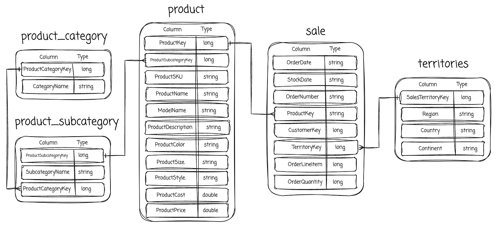
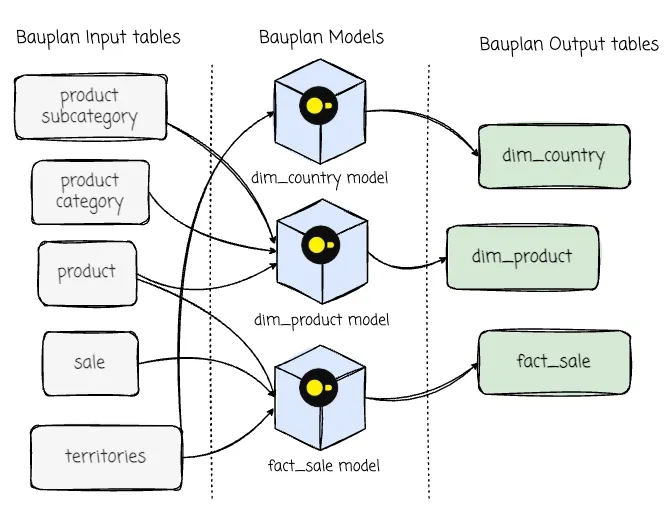
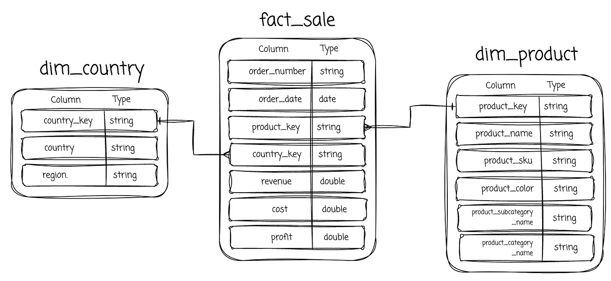

https://github.com/user-attachments/assets/e51dc411-b3dd-431a-814a-afb1f75cf14f
# An example Bauplan pipeline

## 🚀 Overview
We will write **a Bauplan pipeline** that transforms raw data into dimensional model tables.

The input data comes from the AdventureWorks sample dataset. The AdventureWorks database supports standard online transaction processing scenarios for a fictional bicycle manufacturer, Adventure Works Cycles.

### → Input tables: Raw CSV files


### Bauplan pipeline: Defined models in Python


### ← Output tables: Iceberg Table in Bauplan's Catalog



## ✨ Features
- ✅ Bauplan Pipeline 
- ✅ Supported Set-up + Clean-up Scripts 
- ✅ Streamlit App


## 🛠️ Tech Stack
- **Languages**: Python, SQL, Bash
- **Pipeline:** Bauplan's Models
- **Storage:** S3, Bauplan's Catalog
- **Serving:** Streamlit
- **Automation:** Bash Scripts

## 🎯 How to Use
For more details, you can check out the deep-dive article here.
1. Clone this repo:
   ```bash
   git clone https://github.com/yourusername/repo-name.git
2. Enter the folder:
   ```bash
   cd bauplan_example
3. Create the Python virtual environment with the ```requirements.txt```
4. Set up the api_key for Bauplan. [Contact Bauplan for this key](https://www.bauplanlabs.com/#join):
   ```bash
   bauplan config set api_key "your_bauplan_key"
5. Make the bash scripts executable
   ```bash
   chmod -R +x scripts/ 
6. Make sure to configure the AWS CLI:
   ```bash
   aws configure # Entering AWS access key, secret and default region
7. Run the setup script
   ```bash
   ./scripts/setup.sh <bucket name> <bauplan branch>
8. Run the Bauplan pipeline
    ```bash
    bauplan run --project-dir pipeline --namespace adventure 
9. Run the Streamlit app
    ```bash
    streamlit run streamlit/app.py
## 📺 Streamlit Demo
https://github.com/user-attachments/assets/607b8da1-bd35-4c77-8844-95287e34b188


